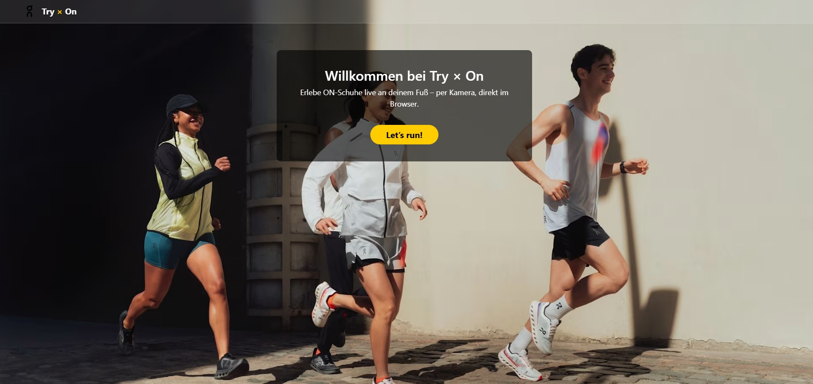
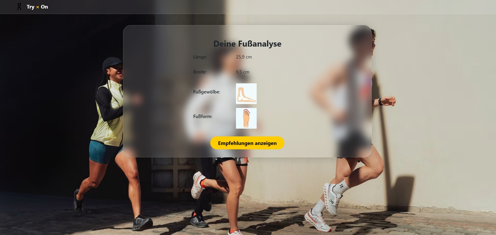
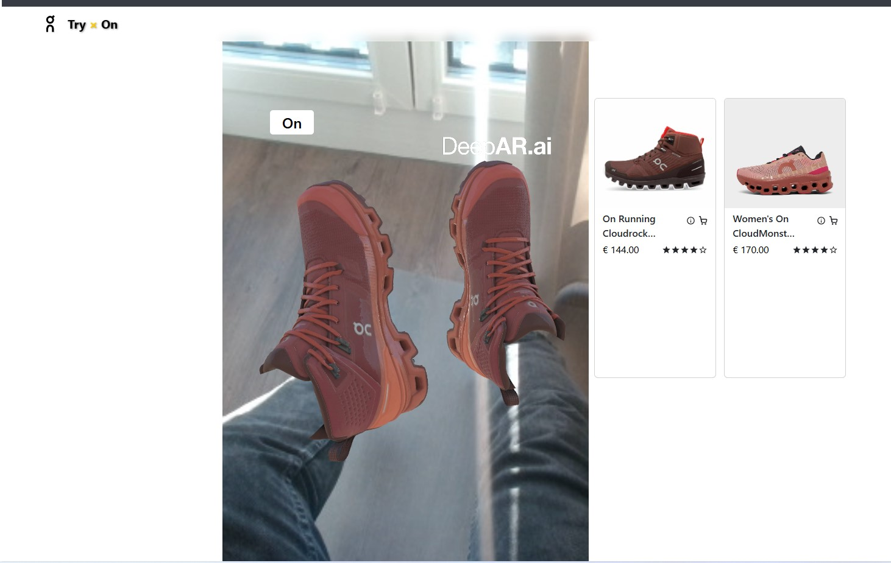
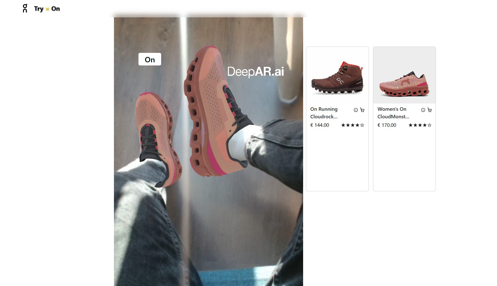

# TryOn AI 👟

> Virtual Shoe Tryfit-On Experience – powered by Canvas Simulation

---

## 🚀 Project Description

**TryOn AI** is a lightweight web demo that allows users to virtually try on ON Running shoes by selecting from available options.  
Built with a focus on simplicity, responsiveness, and showcasing a clear concept for virtual fitting experiences.

---

## 🌟 Features

- Choose between different ON Running shoes
- Visual feedback with instant update on canvas
- Clean, mobile-friendly UI
- Built with Vanilla HTML, CSS, and JavaScript
- Optimized for Vercel hosting

---

## 📸 Screenshots

| Home | Scan Start |
|:--|:--|
|  |  |

| Shoe Selection | Try-On View |
|:--|:--|
|  |  |

---

## 🛠 Tech Stack

- HTML5
- CSS3 (Bootstrap 5)
- JavaScript (ES6)
- Canvas API
- Deployment: Vercel

---

## ⚙️ How to Run

```bash
# 1. Clone the repository
git clone https://github.com/yasinfaridzad/tryfit-on.git

# 2. Navigate into project folder
cd tryfit-on

# 3. Open index.html with a browser
# OR use VSCode Live Server Extension

/public
    /images            # Shoe images, logos
    /effects 
/screenshots
    1.jpg
    2.jpg
    3.jpg
    4.jpg          # .deepar demo files
index.html             # Home landing page
tryon.html 
getInfo.html
detail.html            # Try-on experience page
main.js                # Application logic
README.md              # Project overview

